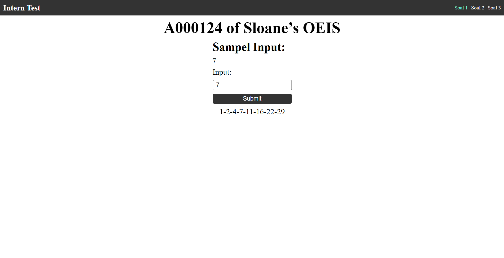
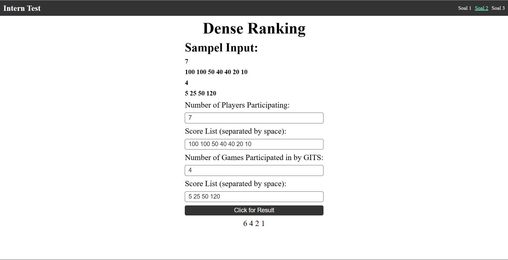
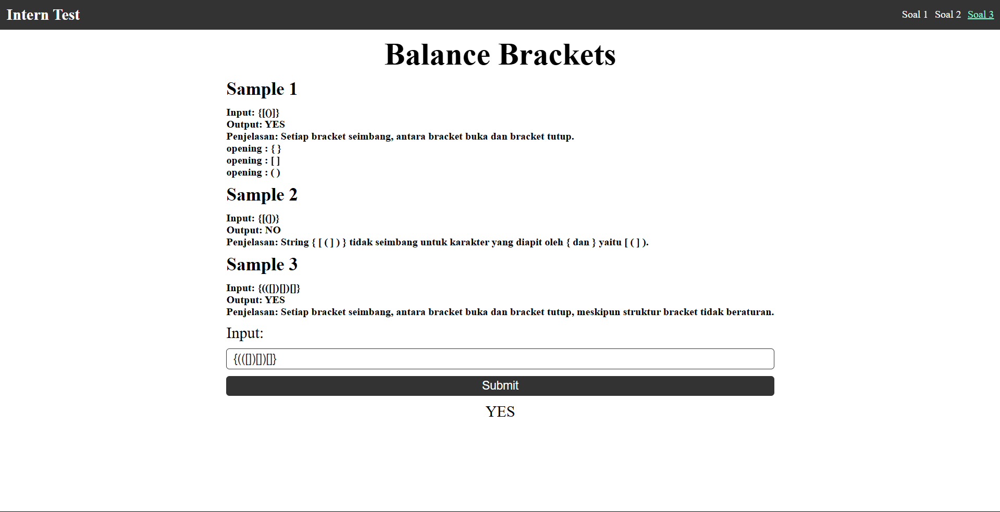

# SOAL 1

#### Hasil untuk input 7

# SOAL 2

#### Hasil untuk input 7 (100 50 40 40 20 10) dan input gits 4 (5 25 50 120)

# SOAL 3

### Code Complexity

#### Kode yang saya buat tidak terlalu kompleks karena saya hanya menggunakan algoritma sederhana dengan kompleksitas waktu O(n) dimana n adalah panjang string input.

#### Dimana fungsi hanya pemeriksaan setiap karakter hanya satu kali.

#### lalu tidak terdapat nested loop atau recursion.

####  

## Result 1

## Result 2

## Result 3

